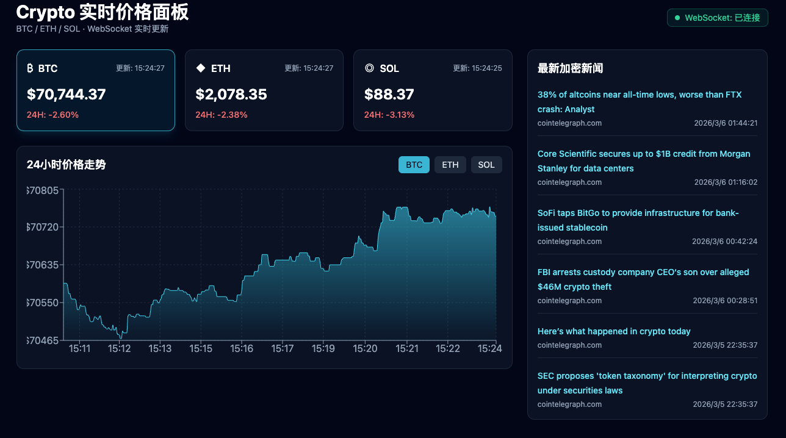

# Crypto Web - 实时加密货币价格看板

实时展示 BTC / ETH / SOL 价格、24H 趋势与加密新闻，前后端通过 Socket.IO 实时推送数据。

## 项目效果



## 功能

- 实时价格卡片（BTC / ETH / SOL）
- 24小时价格走势切换图表
- 新闻流实时推送
- 连接状态显示（连接中 / 已连接 / 断开）
- 市场指标卡片（期权 + 宏观）
- REST API + WebSocket 双通道

## 市场指标（新增）

首页新增了“市场指标（期权 + 宏观）”模块，默认每 30 秒刷新一次，包含：

- 期权数据（Deribit 公共 API）
	- BTC Call Open Interest
	- BTC Put Open Interest
	- BTC Put/Call Ratio
	- ETH Total Open Interest
- 宏观指标
	- DXY（美元指数）
	- US10Y（10年期美债收益率）
	- ES / NQ（标普与纳指期货）
	- BTC Dominance（CoinGecko）
	- Fear & Greed（Alternative.me）

后端提供统一接口：

- `GET /api/market-metrics`

## 技术栈

- 前端：React 18 + TypeScript + Tailwind + Recharts + Vite
- 后端：FastAPI + python-socketio + Redis
- 数据：Binance WebSocket + RSS 聚合 + APScheduler
- 部署：Docker Compose

## 目录结构

```text
cryptoweb/
├── frontend/        # React 前端
├── backend/         # FastAPI + Socket.IO
├── data/            # 数据采集与调度
├── docs/            # 架构与部署文档
├── docker-compose.yml
└── project.md       # 详细项目说明与排查指南
```

## 快速启动（推荐）

在项目根目录执行：

```bash
sudo docker-compose up -d --build
```

查看服务状态：

```bash
sudo docker-compose ps
```

## 访问地址

- 前端：`http://localhost:5173`
- 后端健康检查：`http://localhost:8000/api/health`

如果是远程服务器部署，请将 `localhost` 换成服务器公网 IP，例如：

- `http://118.26.39.18:5173`
- `http://118.26.39.18:8000/api/health`

## 启动成功判定

满足以下条件即代表链路正常：

1. `crypto-redis`、`crypto-data`、`crypto-backend`、`crypto-frontend-dev` 均为 `Up`
2. `GET /api/health` 返回 `{"status":"ok","redis":"up"}`
3. 前端右上角显示 `WebSocket: 已连接`
4. 页面价格和新闻自动刷新

## 常见问题

- 页面一直“连接中”：优先检查 `8000` 端口是否放通（云安全组/防火墙）
- 公网打不开：确认云服务器入站规则已放行 `5173/tcp`、`8000/tcp`
- `docker-compose` 报 `ContainerConfig`：删除异常容器后重启服务

## 停止服务

```bash
sudo docker-compose down
```

---

更多说明见 [project.md](./project.md) 与 [docs/ARCHITECTURE.md](./docs/ARCHITECTURE.md)
